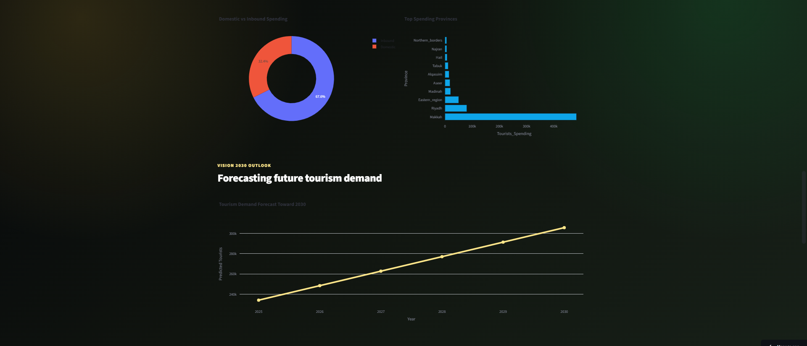
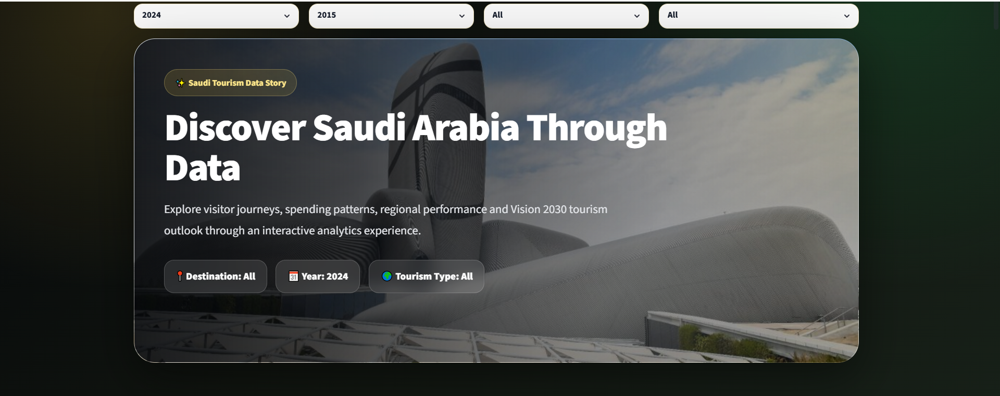

# 🇸🇦 Saudi Tourism Insights Platform

An interactive tourism analytics platform developed to explore tourism trends across Saudi Arabia using data visualization and machine learning.

The application enables users to analyze tourism performance, compare provinces, explore key tourism indicators, and estimate tourism spending through an intuitive Streamlit interface.

---

## 🌐 Live Demo

**Streamlit Application**

https://saudi-tourism-insights-platform-gwwm8zrqjlgnmrhbgwv5sd.streamlit.app/

---

## 📌 Features

* Interactive tourism dashboard
* Province, year, and tourism type filtering
* Tourism trends analysis
* Domestic vs Inbound tourism comparison
* Tourism spending analysis
* Machine learning prediction
* Interactive map of Saudi Arabia
* CSV export
* PDF report generation

---

## 🛠 Technologies

* Python
* Streamlit
* Pandas
* Plotly
* Scikit-learn
* Matplotlib
* Joblib
* FPDF

---

## 📷 Project Preview

### 📊 Power BI Dashboard

### 🌐 Streamlit Application

## 🎯 Skills Demonstrated

* Data Analysis
* Business Intelligence
* Data Visualization
* Machine Learning
* Predictive Analytics
* Dashboard Development
* Interactive Application Development
* Python Programming

---

## 💡 About This Project

The goal of this project was to build an end-to-end analytics solution that combines interactive dashboards, business insights, and predictive analytics in a single application.

Users can explore tourism data through dynamic visualizations, compare tourism performance across Saudi provinces, and generate tourism spending predictions using a trained machine learning model.

---

## 👩‍💻 Author

**Taghreed Mohammed**

Computer Science Graduate | Data Analytics & Business Intelligence

